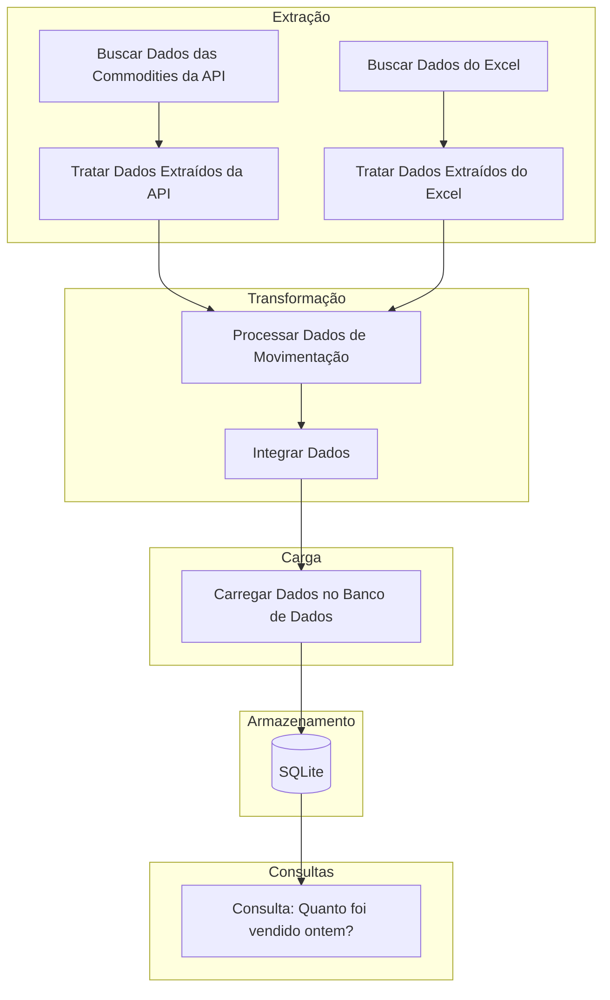

# Projeto de ETL para Análise de Commodities

Este projeto implementa um pipeline ETL (Extração, Transformação e Carga) para analisar dados de commodities, como petróleo bruto, ouro e prata. Utilizamos a biblioteca `yfinance` para extrair dados históricos das commodities, processamos dados de movimentação e armazenamos os dados resultantes em um banco de dados SQLite.

## Estrutura do Projeto

```bash
├── data/
│   ├── dw/
│   │   └── commodities_dw.db
│   ├── external/
│   │   └── movimentacao_commodities.csv
│   ├── logs/
├── .gitignore
├── .python-version
├── extract.py
├── load.py
├── README.md
├── requirements.txt
└── transform.py
```

Para instalar as dependências, execute:

```bash
pip install yfinance
```

## Descrição dos Arquivos

### [extract.py](/extract.py)

Extrai dados históricos das commodities utilizando a API do Yahoo Finance.

### [transforme.py](/transforme.py)

Trata os dados extraídos, processa dados de movimentação e integra os dados.

### [load.py](/load.py)

Carrega os dados integrados em um banco de dados SQLite.

## Executando o Projeto
É possível executar somente o arquivo [load.py](/load.py) para fazer a extração, transformação e carregamento dos dados.

```bash
python load.py
```

1. **Extração de Dados**:
    - Execute [extract.py](/extract.py) para extrair dados históricos das commodities.

    ```bash
    python extract.py
    ```
```bash
                                      Open         High  ...  Stock Splits  simbolo
Date                                                 ...
2024-09-18 00:00:00-04:00    71.139999    71.480003  ...           0.0     CL=F    
2024-09-19 00:00:00-04:00    70.129997    72.489998  ...           0.0     CL=F    
2024-09-20 00:00:00-04:00    72.099998    72.400002  ...           0.0     CL=F    
2024-09-23 00:00:00-04:00    71.309998    71.809998  ...           0.0     CL=F    
2024-09-18 00:00:00-04:00  2570.699951  2570.699951  ...           0.0     GC=F    
2024-09-19 00:00:00-04:00  2566.000000  2588.000000  ...           0.0     GC=F    
2024-09-20 00:00:00-04:00  2590.399902  2621.800049  ...           0.0     GC=F    
2024-09-23 00:00:00-04:00  2646.199951  2659.800049  ...           0.0     GC=F    
2024-09-18 00:00:00-04:00    30.660000    30.730000  ...           0.0     SI=F    
2024-09-19 00:00:00-04:00    30.049999    31.094000  ...           0.0     SI=F    
2024-09-20 00:00:00-04:00    31.065001    31.200001  ...           0.0     SI=F    
2024-09-23 00:00:00-04:00    31.535000    31.549999  ...           0.0     SI=F    

[12 rows x 8 columns]
```

2. **Transformação de Dados**:
    - Execute [transform.py](/transform.py) para tratar, processar e integrar os dados.

    ```bash
    python transforme.py
    ```

3. **Carregamento de Dados**:
    - Execute [load.py](/load.py) para carregar os dados integrados no banco de dados SQLite.

    ```bash
    python load.py
    ```

## Estrutura do Banco de Dados

Os dados integrados são armazenados em um banco de dados SQLite no arquivo [data/dw/commodities_dw.db](/data/dw/commodities_dw.db), na tabela `commodities`.

## Consultas Úteis

### Verificar transações em uma data específica usando o DBeaver

```sql
SELECT *
FROM commodities
WHERE data = '2023-06-17';
```

## Diagramas

Veja abaixo um diagrama do fluxo de dados do projeto.

### Diagrama Mermaid



### Observações

- Certifique-se de ter o arquivo [movimentacao_commodities.csv](/data/external/movimentacao_commodities.csv) no diretório `data/external/`.
- Certifique-se de ter permissões para criar diretórios e arquivos no diretório [data/](/data/).